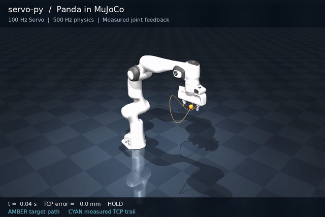

<p align="center">
  <strong>English</strong> &nbsp;·&nbsp; <a href="README.zh-CN.md">简体中文</a>
</p>

<p align="center">
  <picture>
    <source media="(prefers-color-scheme: dark)" srcset="docs/assets/brand/logo-dark.svg">
    
  </picture>
</p>

<p align="center">
  <strong>Realtime robot control with C++ and Python.</strong><br>
  C++ core &nbsp;·&nbsp; Python API &nbsp;·&nbsp; ROS-independent
</p>

<p align="center">
  <a href="#quick-start">Quick start</a> &nbsp;·&nbsp;
  <a href="#panda-demo">Panda demo</a> &nbsp;·&nbsp;
  <a href="https://openghz.github.io/servopy/">Documentation</a>
</p>

---

**ServoPy** is a library for **realtime joint and Cartesian servo control**, with a C++ core, a Python API, and no ROS dependency. At every control cycle, it uses the latest target and measured joint feedback to update the next motion command for your controller.

Keep sending joint positions, joint velocities, end-effector poses or twists while the robot moves. Targets can come from a teleoperation interface, a vision loop or another application; ServoPy continuously updates its output as those targets change. Your application supplies the target source and device connection.

<p align="center">
  <a href="docs/media/panda-servo.mp4">
    
  </a>
</p>

<p align="center">
  Panda in MuJoCo · Recorded torque mode · 100 Hz servo / 500 Hz physics<br>
  <a href="docs/media/panda-servo.mp4">Watch the video</a> &nbsp;·&nbsp;
  <a href="docs/media/panda-servo.json">Measured results</a>
</p>

## Realtime servo control

- **Update targets during motion.** Stream joint or Cartesian commands; the latest-target mailbox keeps the newest command for the next control cycle.
- **Close the feedback loop.** Call `Servo.step()` with fresh measured state each cycle, or use `ServoRunner` to connect feedback, output and device stop callbacks on a periodic schedule.
- **Constrain each control update.** Apply joint position, velocity and acceleration limits, singularity handling and optional Ruckig jerk control. Expired commands request braking; feedback and timing faults are explicit.
- **Use your kinematics and IK.** Choose native URDF or Pinocchio kinematics, DLS or bounded QP, optional nullspace posture objectives, or connect an existing Python position IK solver.
- **Inspect a running controller.** Try all three Panda control modes, stream live targets, and record or replay control sessions.

Each `step()` produces the reference for the next control interval. A new target can be used at the next cycle without waiting for the previous target to finish. Read the [realtime servo guide](https://openghz.github.io/servopy/realtime-servo/) for a complete example with changing targets, a slower command source, and braking when the stream stops.

Here, **realtime** means continuously responding to targets and feedback in a periodic control loop. `ServoRunner` uses best-effort Python scheduling; ServoPy does not guarantee hard real-time deadlines. Timing requirements and device responsibilities are covered in the [execution contract](https://openghz.github.io/servopy/design/).

NumPy is the only required third-party Python runtime dependency. Building from source also needs a C++ toolchain. MuJoCo, Pinocchio and Ruckig are optional.

## Quick start

You need **Python 3.10 or newer**. [ServoPy 0.3.0 is available on PyPI](https://pypi.org/project/servo-py/0.3.0/) with Linux wheels for CPython 3.10–3.14 on x86_64 and ARM64 (glibc 2.28+), including example code and small URDFs. Panda model assets are downloaded only when running that demo.

Install in a virtual environment without a C++ compiler:

```bash
python3 -m venv .venv
source .venv/bin/activate
python -m pip install --upgrade pip
python -m pip install --only-binary=:all: servo-py
python -m servo_py.examples.track_pose
```

To run the current source checkout, you also need a **compiler supporting C++17 or newer**. C++17 is the minimum language standard. See the [installation requirements](https://openghz.github.io/servopy/getting-started/#1-准备环境) for build dependencies and the tested environment.

```bash
git clone https://github.com/OpenGHz/servopy.git
cd servopy
python -m venv .venv
source .venv/bin/activate
CMAKE_BUILD_PARALLEL_LEVEL=2 python -m pip install .
python examples/track_pose.py
```

No display or robot is needed. This ideal-feedback example runs **1,200 steps**, finishes in **HOLD**, and reports a final position error of approximately **9.8e-5 m**. It tests reference generation without simulating dynamics.

### Your first control step

After installing the package, run this complete example from any directory. It shows one control cycle: `Servo.step()` consumes the latest target and measured feedback, then returns the next reference for your simulator or device adapter to execute. In a running controller, repeat this cycle with fresh feedback and the latest command.

<!-- runnable: readme-step -->
```python
from importlib.resources import files
from servo_py import (
    Action, JointPositionCommand, JointState, Servo, ServoConfig, load_urdf,
)

model = load_urdf(
    files("servo_py.examples").joinpath("planar2.urdf"), base="base", tip="tool",
    acceleration_limits=[3.0, 3.0],
)
servo = Servo(model, ServoConfig(task_axes=(0, 1)))
result = servo.step(
    JointState(q=[0.5, -1.0], dq=[0.0, 0.0], stamp_ns=0),
    JointPositionCommand(positions=[0.7, -0.7], stamp_ns=0),
    dt=0.01, now_ns=0,
)
if result.action == Action.REJECT:
    raise RuntimeError(result.message)
print(result.action.name, result.reference.q)
```

Expected output: `TRACK [ 0.50015 -0.99985]`. Continue with the [complete loop with changing targets](https://openghz.github.io/servopy/realtime-servo/) and [device integration](https://openghz.github.io/servopy/runtime/).

## Panda demo

After the quick start, add MuJoCo and choose a control mode:

```bash
python -m pip install --only-binary=:all: 'servo-py[mujoco]'
servo-py-panda --control-mode joint-position
```

| `--control-mode` | Target → reference → actuator |
|---|---|
| `torque` (default) | Pose → differential IK → joint reference → torque control |
| `joint-position` | Joint target → joint reference → position actuator |
| `ik-position` | Pose → position IK → joint reference → position actuator |

The viewer runs an 18-second simulation with a 100 Hz servo loop and 500 Hz physics. Each servo cycle reads MuJoCo feedback and updates the control reference. Press **Space** to pause, or add `--headless` to run without a display. Use `--target-stdin` to drive it with a live JSONL target stream; see [streaming targets](https://openghz.github.io/servopy/recording/#panda-外部目标与回放).

Wheels and source distributions omit the Panda model; the installed demo downloads about 5 MB once, verifies its checksum, and caches it for offline reuse. A Git checkout can use its existing archive. The [Panda guide](https://openghz.github.io/servopy/mujoco-panda/) covers offline model paths, Ruckig smoothing, external targets, recording and measured tracking behavior.

## Documentation

[Read the documentation online →](https://openghz.github.io/servopy/) — searchable guides, tutorials and API reference.

**Guides and API reference are currently in Chinese.** The [design contract](https://openghz.github.io/servopy/design/) and [validation record](https://openghz.github.io/servopy/validation/) are in English; this README contains a complete English quick start.

| Next step | Read |
|---|---|
| Build a realtime control loop | [Realtime servo](https://openghz.github.io/servopy/realtime-servo/) · [Devices & scheduling](https://openghz.github.io/servopy/runtime/) |
| Write a controller | [Joint control](https://openghz.github.io/servopy/joint-position/) · [Position IK](https://openghz.github.io/servopy/python-ik/) |
| Tune or extend it | [Smoothing](https://openghz.github.io/servopy/smoothing/) · [QP & nullspace](https://openghz.github.io/servopy/solvers/) · [C++](https://openghz.github.io/servopy/cpp/) |
| Connect and inspect | [Devices & scheduling](https://openghz.github.io/servopy/runtime/) · [Recording & replay](https://openghz.github.io/servopy/recording/) |
| Look up an interface | [API](https://openghz.github.io/servopy/api/) · [Configuration](https://openghz.github.io/servopy/configuration/) · [Troubleshooting](https://openghz.github.io/servopy/troubleshooting/) |

[Browse all documentation →](https://openghz.github.io/servopy/)

## Project status

Release **0.3.0** passed installed-wheel checks on Ubuntu 22.04 and 24.04: **188 Python tests on x86_64**, and **176 on ARM64** with optional Ruckig checks skipped. Validation also includes a standalone C++ test and Panda dynamics in all three control modes. Conditions and results are preserved in the [validation record](https://openghz.github.io/servopy/validation/).

The realtime servo loop outputs motion references for a downstream controller; the application owns feedback, actuator commands and device stopping. Physical-robot validation, geometric collision checking and hard real-time execution are outside the current verified scope. Position-mode Panda demos retain gravity-related tracking offsets. See the [roadmap](https://openghz.github.io/servopy/roadmap/) for capability boundaries.

## Contributing

See the [contribution guide](CONTRIBUTING.md) for setup, relevant tests and documentation checks, and the [changelog](CHANGELOG.md) for API migration notes. You can preview the searchable documentation locally with:

```bash
python -m pip install '.[docs]'
python scripts/check_docs.py
python -m mkdocs serve
```

## License

ServoPy is [MIT-licensed](LICENSE). Panda assets are Apache-2.0; their provenance and dependency notices are in [NOTICE](NOTICE). ServoPy is an independent project and does not claim MoveIt compatibility.
