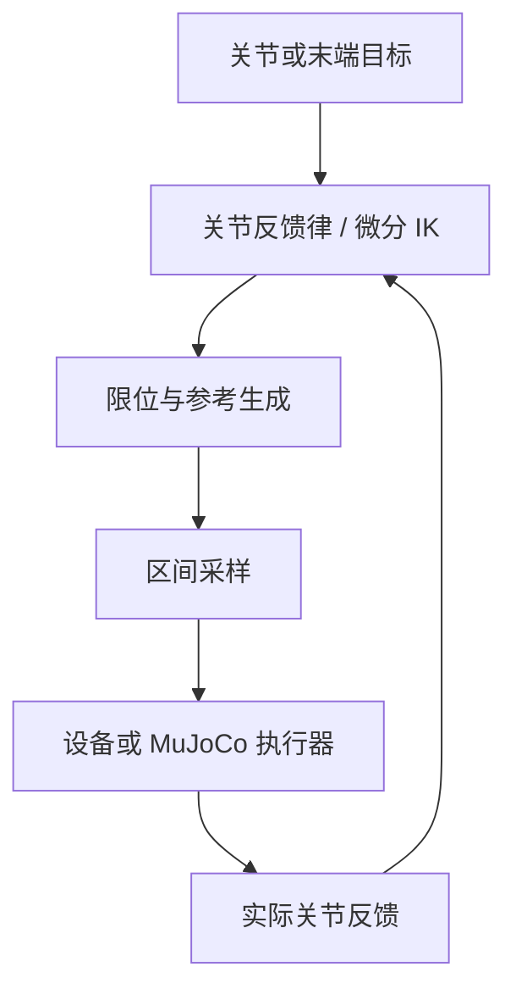

# 模型、目标与参考

ServoPy 的实时控制循环持续读取目标和反馈，并更新控制输出。这里有三个不同的量：**目标**是当前希望跟踪的位置或速度，可以在运动中改变；**反馈**是设备实际测到的关节状态；**参考**是 Servo 为下一控制区间生成的输出。先通过[实时伺服示例](realtime-servo.md)观察目标更新，再用本页约定调参和排障。

## 一次控制循环经过什么

`Servo.step()` 计算到参考生成这一步；应用负责读取设备与执行输出，并在下一周期重复这一闭环。每次调用可采用新的目标，无需等待旧目标到达。`sample_reference(t)` 提供上一成功区间的插值。理想回放可以把参考当作下一反馈，真实设备必须始终使用测量值。

## 选择输入类型

| 你手里的目标 | 输入 | 内核如何处理 |
|---|---|---|
| 每个关节的位置 | `JointPositionCommand` | 关节位置反馈律；可选 Ruckig 随当前目标更新位置轨迹 |
| 关节速度 | `JointJogCommand` | 约束目标速度，生成下一周期参考 |
| TCP 位姿 | `PoseCommand` | 位姿误差 → 任务速度 → 微分 IK |
| TCP 线速度与角速度 | `TwistCommand` | 任务速度 → 微分 IK |
| 停止 | `StopCommand` | 受约束地减速到静止 |

已有位置 IK 时，先调用 `PositionIKAdapter`，再把解算后的 JointPosition 交给 Servo。它和 Pose/Twist 内部的 `DifferentialIK` 是两个接入点。[位置 IK 教程](python-ik.md) 对两者作了完整对照。

## 数据与单位

| 数据 | 约定 |
|---|---|
| `q`、关节目标 | `(n,)`，转动关节 rad、移动关节 m |
| `dq`、`ddq`、jerk | 相应关节单位除以 s、s²、s³ |
| 关节顺序 | `model.joint_names()`；反馈不带名称映射 |
| Pose | `(4, 4)` 刚体变换，基座坐标系下的 TCP 位姿 |
| Jacobian | `(6, n)`，前三行为 TCP 线速度，后三行为角速度，均在 base 中表达 |
| Twist | 线速度 m/s、角速度 rad/s；作用点始终是 TCP |
| `dt` | 下一个参考区间的时长，单位秒 |
| `stamp_ns`、`now_ns` | 同一单调时钟中的非负 int64 纳秒 |

`TwistCommand.expressed_in` 可以是 `base` / `tool` 或模型对应帧名。使用 tool 表达时只旋转分量，不改变 TCP 作用点。Pose 只接受 base 表达，不能直接传世界坐标下未经转换的目标。

## 任务轴与模型

`task_axes` 的索引顺序是 `[vx, vy, vz, wx, wy, wz]`。二维示例控制 x/y，应设 `task_axes=(0, 1)`；控制维数不得大于模型自由度，即使只发送关节命令也要满足构造配置的要求。

`load_urdf(path, base=..., tip=..., acceleration_limits=...)` 读取指定串联链。支持固定、转动、连续转动和移动关节，保留固定变换与 TCP 偏置。加速度上限必须显式提供；位置、速度上限来自 URDF，可覆盖速度上限。连续关节保持展开参考，角差采用最短路径。

选中链中的 mimic、浮动、平面和闭链模型不受支持。基础加载器不读取 mesh、动力学或碰撞几何。可选 `PinocchioModel` 和自定义 `Kinematics` 仍须满足标量关节表示 `nq == nv` 的 Servo 边界。

## 时间戳如何推进

若当前调用 `now_ns=0`、`dt=0.01`，输出参考的时间是 `10_000_000 ns`。下一次调用应在该端点附近进行；允许误差为 `timing_tolerance × 前一次 dt`。`dt` 表示计划区间，不是通过反复修改它来掩盖迟到的工具。

| 时刻 | 读取反馈 | 本次调用 | 输出端点 |
|---|---|---|---|
| 第 0 步 | 获取时间不晚于 0 | `now_ns=0` | 10 ms |
| 第 1 步 | 获取时间不晚于 10 ms | `now_ns=10_000_000` | 20 ms |

设备反馈、上游目标与当前时间分别检查新鲜度。重复读取同一旧消息不能刷新其源时间戳。教程中的静态目标由本地任务每周期主动重新发布，表示任务仍在要求跟踪；这不同于把断流的数据伪装成新消息。

## 如何理解完成与停止

`HOLD` 表示参考静止；`GOAL_REACHED` 表示相应目标误差进入容差。两者都不单独证明真实设备已经停止。开启零空间目标时，TCP 已到达容差也可能继续姿态运动，出现 `GOAL_REACHED` 与 `TRACK` 同时成立。

`REJECT` 不返回参考且锁存故障；设备适配层应取消旧缓冲并请求停止。原因排除后再显式恢复。完整动作表、flags 和诊断字段见 [状态参考](status.md)，数学推导见 [执行契约](design.md)。

下一步：[关节控制](joint-position.md) · [Python IK](python-ik.md) · [配置参数](configuration.md)
