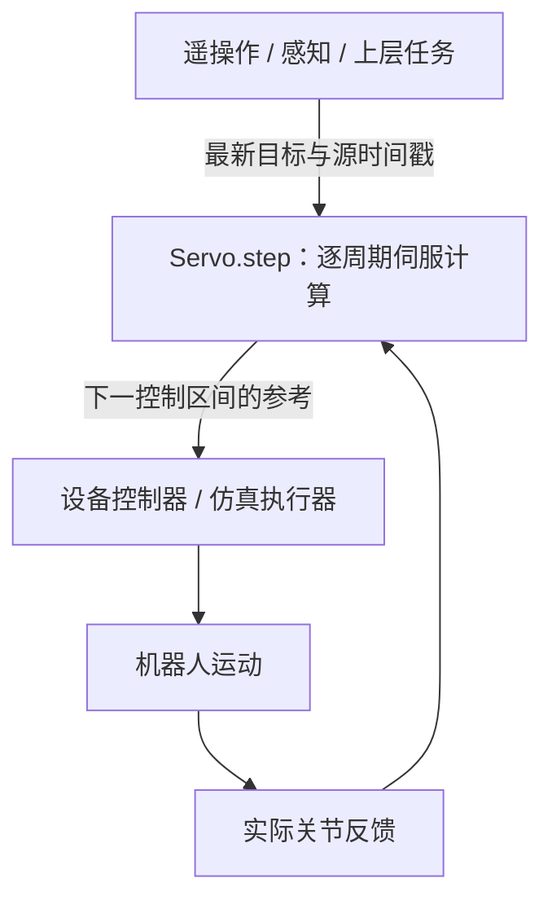

# 实时伺服控制（Realtime Servo）

**目标：** 把持续变化的目标接入机器人控制循环，理解命令更新、反馈、周期和超时如何配合。完成[安装](getting-started.md)后即可运行本页示例。

ServoPy 的主要功能是**实时关节与笛卡尔伺服控制**。机器人运动时，上游可以继续更新目标；每个控制周期，ServoPy 使用最新命令与实际关节反馈，计算下一控制区间的输出。遥操作、视觉伺服、交互式关节控制和持续位姿跟踪都可以按这一方式接入。手柄、视觉算法和设备 SDK 由应用提供。

## 持续更新的控制循环



每个周期完成三件事：

1. 读取实际关节状态，以及上游最新的关节或末端命令。
2. 调用 `Servo.step()`，在时序、限位和所选求解器约束下生成下一控制区间的参考。
3. 把参考交给设备执行；下一个周期再次读取实际反馈并更新输出。

**新目标无需等待旧目标到达。** `LatestCommand` / `ServoRunner.commands` 只保留最新命令，下一周期读取它；参考速度、加速度和可选 jerk 约束仍然生效，因此目标突变不会被解释为要求关节瞬间跳变。

ServoPy 位于目标来源与下游执行器之间。应用已有路径规划器时，可以把路径跟踪器产生的当前目标交给 ServoPy；感知或遥操作也可以直接产生实时目标。设备适配层负责实际发送、插值与停止。

## 上游目标频率与伺服频率

上游命令不必与伺服循环同频。例如，感知或遥操作每 50 ms 发布一个新目标（20 Hz），伺服循环每 10 ms 读取实际反馈并计算一次（100 Hz）。两次上游更新之间可以继续使用尚未过期的目标，**必须保留它的源时间戳**。

命令周期、传输延迟和抖动需要一起落在 `command_timeout` 预算内。目标过期时，在反馈仍有效且制动可行的条件下，Servo 请求受约束制动。反馈失效、时序错误或其他锁存故障返回 `REJECT`，应用必须调用设备停止机制。行为细节见[动作与诊断](status.md)。

## 完整示例：运动中反向，断流后停止

下面用 20 Hz 命令源驱动 100 Hz 伺服循环：第 1 秒给第一关节正速度，第 2 秒改为负速度，之后停止发送命令。循环继续读取反馈，直到过期命令引发制动并进入 HOLD。没有重新构造或复位 Servo。

此例使用整数仿真时钟和理想反馈，可以快速执行；它用于演示在线控制行为，不测量墙钟实时性能。真实设备必须用测量值替换 `q, dq = ...`。

<!-- runnable: realtime-target-stream -->
```python
from importlib.resources import files
import numpy as np
from servo_py import (
    Action, JointJogCommand, JointState, LatestCommand, SafetyFlag,
    Servo, ServoConfig, load_urdf,
)

model = load_urdf(
    files("servo_py.examples").joinpath("planar2.urdf"),
    base="base", tip="tool", acceleration_limits=[3.0, 3.0],
)
servo = Servo(model, ServoConfig(task_axes=(0, 1), command_timeout=0.1))
commands = LatestCommand()
q, dq = np.array([0.5, -1.0]), np.zeros(2)
observed = {}

for tick in range(400):
    now = tick * 10_000_000  # 100 Hz 伺服时间
    if tick < 200 and tick % 5 == 0:  # 上游仅以 20 Hz 发布新命令
        speed = 0.2 if tick < 100 else -0.2
        commands.publish(JointJogCommand([speed, 0.0], stamp_ns=now))

    result = servo.step(
        JointState(q=q, dq=dq, stamp_ns=now),
        commands.read(),  # 保留源时间戳；断流后不伪造新命令
        dt=0.01, now_ns=now,
    )
    if result.action == Action.REJECT:
        raise RuntimeError(result.message)
    q, dq = result.reference.q, result.reference.dq  # 仅用于理想反馈示例
    if tick in (50, 150):
        observed[tick] = float(dq[0])

assert observed[50] > 0 and observed[150] < 0
assert result.flags & SafetyFlag.STALE_COMMAND
assert result.action == Action.HOLD
print("Forward, reverse, command expired:", result.action.name)
```

预期输出：`Forward, reverse, command expired: HOLD`。该例展示了新目标参与后续控制计算，以及上游停止发布后的超时响应。位置和位姿命令同样可以在运行中更新；具体接口见[关节控制](joint-position.md)和[位置 IK 接入](python-ik.md)。

## 在真实时间中运行

用 `ServoRunner` 按单调墙钟调度周期，并用设备协议读取反馈、发送区间参考。上游生产者通过 `runner.commands.publish(command)` 更新目标，单个消费线程执行 `runner.run()`。已有控制线程的应用也可以直接周期调用 `Servo.step()`。完整设备契约与 SDK 回调见[实时循环与设备](runtime.md)。

Panda 示例已经具备实时外部目标入口：

```bash
servo-py-panda --control-mode joint-position --target-stdin --log run.jsonl
```

应用通过 stdin 连续发送 JSONL 目标；默认命令超时为 100 ms，因此单次手工输入只会短暂生效。默认示例运行 18 秒，最后一秒执行停止；EOF 也会清除目标。stdin 模式按墙钟节拍推进，包括 `--headless`。输入格式与时间戳约定见[实时目标输入](recording.md#panda-外部目标与回放)。

## Realtime 与硬实时的边界

本项目用 **realtime** 描述运行中持续响应目标和反馈的伺服控制能力。控制频率是应用配置，能否按时完成还取决于求解、设备通信、操作系统调度和其他负载。

- `ServoRunner` 使用绝对周期和迟到预算；超预算时请求设备停止，不补发积压周期。Python 调度属于 best effort，无法抢占阻塞回调。
- C++ 内核可独立嵌入应用的控制线程，但当前实现包含动态内存分配；切换到 C++ 本身不构成硬实时或无分配保证。
- Panda 的 100 Hz 控制 / 500 Hz 物理是示例配置。理想反馈循环、仿真时间与单次计算耗时都不能证明真实设备的固定频率或最坏延迟。

设备侧 watchdog、通信超时和停止机制由应用与设备提供。具体约定见[执行契约](design.md)，已有测量及其环境见[验证记录](validation.md)。

下一步：[实时循环与设备](runtime.md) · [Panda 闭环仿真](mujoco-panda.md) · [输入、记录与回放](recording.md)
